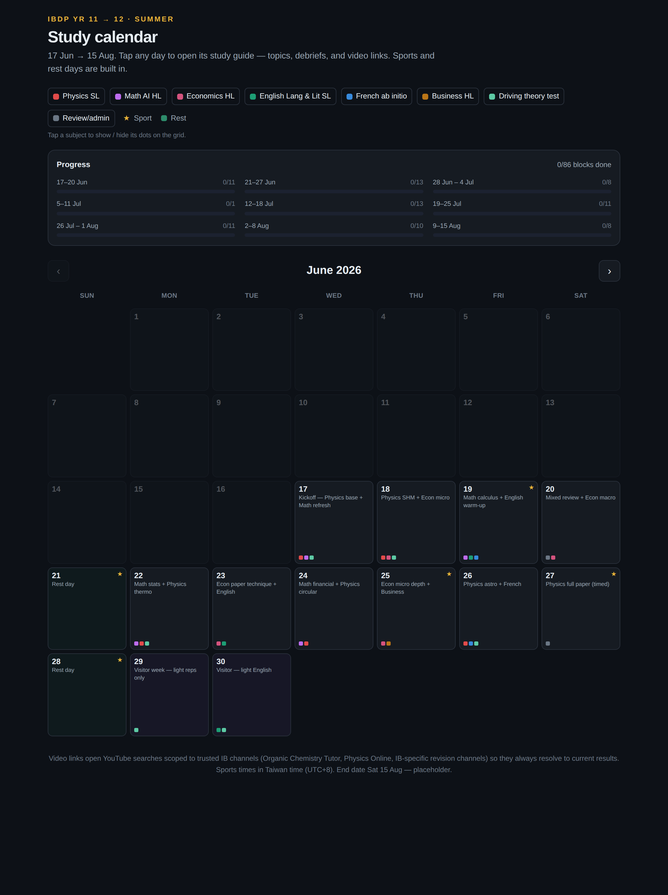
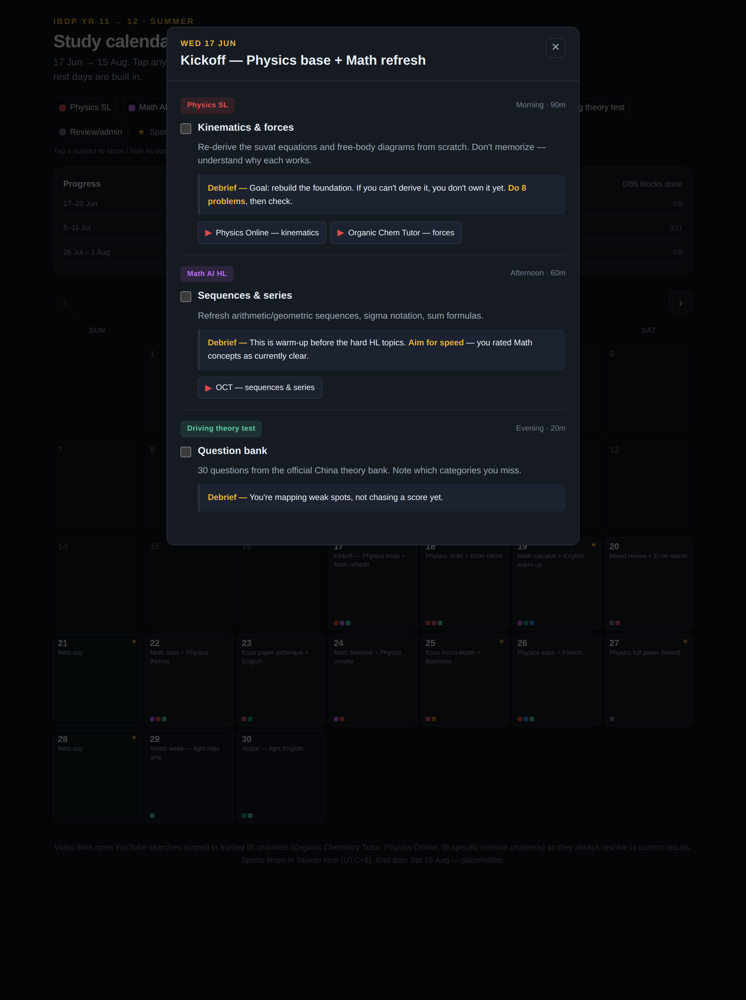

# Study Calendar

**Live app:** https://lucashendrickx09.github.io/LukiPuk1e/

A personal IBDP summer study calendar — a single-purpose static web app. No auth,
no backend, no database. Everything lives in one editable data file
([`src/plan.ts`](src/plan.ts)) and runs entirely in the browser.

It renders a **real month-grid calendar** (17 Jun → 15 Aug 2026, navigable across
June / July / August). Each day shows small colored dots for the subjects studied
that day and a ★ for sport events. Tap a day to open its full study guide:
topics, "what to do", exam-focused debriefs, and video links.




---

## Features

- **Month-grid calendar** with prev/next month navigation (Jun → Aug 2026).
- **Per-day study guide modal**: subject pill, topic + time, "what to do",
  a highlighted **Debrief** callout (exam tip), and video buttons that open in a
  new tab.
- **Subject colors** as dots on each day; **★** marks days with a sport event.
- **Special day types**: rest days (green, "recover"), holiday 7–11 Jul (amber,
  "fully off"), visitor week 30 Jun–6 Jul (purple, light study only).
- **Video links** are YouTube *search* URLs scoped to trusted IB channels, so they
  always resolve to current results — and they're data-driven, so you can swap in
  specific video URLs later.
- **Approve or reschedule each task**: mark a study block complete, or — if you
  can't do it — reschedule it to another day. The app **recommends** good days
  (soonest, lightest, same-subject; avoids rest/holiday) but you pick any day.
  Rescheduled tasks actually move: a "rescheduled →" stub stays on the origin day
  and the task reappears on the target day tagged "moved from". State persists to
  `localStorage`, with a per-week progress bar.
- **Subject filter + legend**: tap a subject to show/hide its dots on the grid.
- **Today highlight**, **keyboard support** (Esc closes the modal), click-outside
  to close, smooth modal animation.
- **Mobile-responsive** — works as a real calendar on a phone.
- **Full-screen view** — a detail-rich, full-window calendar (theme + task list per
  day) with a top-right exit button.
- **Work ahead** — pull a later day's task forward to do it early; it leaves the
  later day automatically (the reverse of rescheduling).
- **Extended Essay** is built into the plan as a subject (~3h/week: topic → sources
  → outline → drafts → RPPF reflections).
- **Installable PWA** — add it to your phone's home screen or your desktop and use
  it offline; it updates itself on next launch.

## Tech stack

Vite · React · TypeScript · Tailwind CSS v4 · date-fns. Builds to a static
`dist/` folder you can host anywhere.

---

## Using it day to day

Open a day and, for each task, either:

- **✓ Mark complete** — approves the task as done (it shows struck-through and
  counts toward that week's progress). Hit **Undo** to revert.
- **Can't do — reschedule** — opens a small picker with up to three **recommended
  days** (it favours the soonest, lightest days and days already studying the same
  subject, and skips rest/holiday days) plus a date field to choose **any** day in
  the window. Recommendations are only suggestions — you decide.

A rescheduled task **moves**: its origin day keeps a dimmed "rescheduled → {day}"
stub (with **Undo**), and the task reappears on the target day tagged "moved from
{day}", where you can complete or move it again. On the grid, a ✓ marks days where
every task is done and a ⤳ marks days a task was moved onto; the colored dots and
weekly progress follow the task to its new day.

All of this is per-browser (`localStorage`) — nothing is sent anywhere.

---

## Install it as an app

It's a PWA, so you can install it on any device straight from the browser — no App
Store, no accounts:

- **iPhone / iPad (Safari):** open the site → Share → **Add to Home Screen**.
- **Android (Chrome):** open the site → menu (⋮) → **Install app** / **Add to Home Screen**.
- **Desktop (Chrome / Edge):** click the **Install** icon in the address bar
  (or menu → **Install Study Calendar**).

It launches full-screen with its own icon and works **offline** (it caches itself
after the first visit). New versions update automatically on next launch.

---

## Syncing across devices (Supabase)

By default your completions and reschedules live in the browser's `localStorage`,
which is **per-device**. Optional sync stores them in a tiny **Supabase** document
so every device that enters the same passphrase shares one calendar — changes
appear within seconds. There's **no login**: the passphrase is the link between
devices (it's hashed to a document id, never sent in the clear as a key).

If the two env vars below aren't set, the app simply stays local-only — and the
Supabase client is tree-shaken out of the bundle entirely, so you pay nothing for
a feature you're not using. The **Sync** button (top-right) tells you the state.

### One-time setup

1. **Create a free project** at [supabase.com](https://supabase.com).
2. **Create the table + access rules.** In the project's **SQL Editor**, run:

   ```sql
   create table if not exists study_calendar_state (
     id text primary key,
     data jsonb not null default '{}'::jsonb,
     updated_at timestamptz not null default now()
   );

   -- bump updated_at on every write (used to arbitrate last-writer-wins)
   create or replace function study_calendar_touch()
   returns trigger language plpgsql as $$
   begin new.updated_at = now(); return new; end $$;
   drop trigger if exists study_calendar_touch on study_calendar_state;
   create trigger study_calendar_touch
     before update on study_calendar_state
     for each row execute function study_calendar_touch();

   -- single-user app, no login: allow anonymous access. Your data is only
   -- reachable by its id, which is the SHA-256 of your private passphrase.
   alter table study_calendar_state enable row level security;
   create policy "anon read"   on study_calendar_state for select using (true);
   create policy "anon insert" on study_calendar_state for insert with check (true);
   create policy "anon update" on study_calendar_state for update using (true) with check (true);

   -- optional: instant push updates (the app also syncs on focus without this)
   alter publication supabase_realtime add table study_calendar_state;
   ```

3. **Get your keys.** Project → **Settings → API** → copy the **Project URL** and
   the **anon public** key (the anon key is meant to be shipped in the client).
4. **Set the env vars.** Locally, copy `.env.example` to `.env.local` and fill in:

   ```
   VITE_SUPABASE_URL=https://YOUR-PROJECT-REF.supabase.co
   VITE_SUPABASE_ANON_KEY=YOUR-PUBLIC-ANON-KEY
   ```

   For your deployed site, add the **same two variables** in your host's settings
   (Vercel: Project → Settings → Environment Variables; Netlify: Site configuration
   → Environment variables) and redeploy. Restart `npm run dev` after changing them.
5. **Link your devices.** Open the app → **Sync** → enter a passphrase → **Connect**.
   Enter the **same passphrase** on your phone and computer. Done — they now share data.

> **Security:** because there's no login, anyone who knows your passphrase (and has
> the public anon key from the site) can read and edit your calendar. Use a
> non-obvious passphrase and keep it private. For a personal study planner that
> trade-off is usually fine; if you want stricter access, add Supabase Auth and
> tighten the RLS policies to `auth.uid()`.

### How conflicts are handled

Sync is last-writer-wins on the whole document, arbitrated by the server's
`updated_at`. A device pushes its changes (debounced) and pulls on realtime
events, tab focus, and a light interval. For one person using one device at a
time this is conflict-free; simultaneous offline edits on two devices would let
the later save win. All the sync code is isolated in
[`src/lib/sync.ts`](src/lib/sync.ts) + [`src/lib/useSync.ts`](src/lib/useSync.ts).

---

## Getting started

```bash
npm install
npm run dev      # start the dev server (http://localhost:5173)
```

Build and preview the production bundle:

```bash
npm run build    # type-checks, then outputs static files to dist/
npm run preview  # serve the built dist/ locally to sanity-check
```

> **Note on `--configLoader runner`:** the npm scripts pass this Vite flag so the
> config is loaded directly instead of being pre-bundled by esbuild. It exists
> only because this project lives in a **subdirectory** of a repo whose root has
> an unrelated Expo `tsconfig.json`; the flag stops Vite from walking up into it.
> If you ever copy this project out to its own repo, the flag is harmless to keep
> or remove.

---

## Editing the plan

**All schedule data is in [`src/plan.ts`](src/plan.ts)** and is meant to be edited
by hand. It's heavily commented. The shape:

```ts
'2026-06-17': {
  theme: 'Kickoff — Physics base + Math refresh',
  blocks: [
    block(
      'PH',                       // subject code (keys of SUBJECTS)
      'Kinematics & forces',      // topic heading
      'Re-derive the suvat …',    // "what to do"
      'Goal: rebuild … <b>Do 8 problems</b>.', // debrief (exam tip; <b> allowed)
      [ vid('Physics Online — kinematics', 'Physics Online IB kinematics suvat') ],
      'Morning · 90m',            // time label
    ),
  ],
},
```

Common edits:

- **Add a day** → add a new `'YYYY-MM-DD': { … }` key.
- **Mark a day type** → set `rest: true`, `holiday: true`, or `visitor: true`.
- **Add a sport event** → set `sport: 'USA v Australia — 06:00 …'` (adds a ★ and a
  banner).
- **Add a subject** → add an entry to `SUBJECTS` (code, name, color) and, if it
  should appear in the legend/filter, to `STUDY_SUBJECTS`.
- **Pin a real video** instead of a search → replace `vid('Label', 'query')` with a
  literal `{ label: 'Label', url: 'https://youtu.be/…' }`.
- **Change the calendar window** → edit `PLAN_START_ISO` / `PLAN_END_ISO` at the
  bottom of the file (and the visible months in `src/lib/dates.ts` if you move
  outside Jun–Aug).

No other file needs to change for day-to-day schedule edits.

---

## Project structure

```
study-calendar/
├─ index.html
├─ src/
│  ├─ plan.ts              ← all schedule data + types (edit this)
│  ├─ App.tsx              ← top-level state (month, modal, completion, filter)
│  ├─ main.tsx
│  ├─ index.css            ← Tailwind v4 theme tokens + small base styles
│  ├─ lib/
│  │  ├─ dates.ts          ← date-fns helpers, month grid, week grouping
│  │  └─ storage.ts        ← localStorage for completion
│  └─ components/
│     ├─ Header.tsx
│     ├─ SubjectBar.tsx    ← legend + subject filter
│     ├─ WeekProgress.tsx  ← per-week progress bars
│     ├─ MonthNav.tsx
│     ├─ CalendarGrid.tsx
│     ├─ DayCell.tsx       ← one day (dots, star, tint, tagline)
│     └─ DayModal.tsx      ← the day study-guide modal
└─ vite.config.ts
```

---

## Deploying

The build is a fully static `dist/` — host it on anything. Because this project
lives in the **`study-calendar/` subdirectory** of the repo, point your host at
that subdirectory.

Asset URLs are relative (`base: './'` in `vite.config.ts`), so the same build works
at a domain root **or** under a sub-path like `username.github.io/LukiPuk1e/` with
no extra config.

### Vercel

1. Import the repo.
2. Set **Root Directory** to `study-calendar`.
3. Framework preset: **Vite** (Build `npm run build`, Output `dist`). Deploy.

### Netlify

- **Base directory:** `study-calendar`
- **Build command:** `npm run build`
- **Publish directory:** `study-calendar/dist`

(Or commit a `netlify.toml` with those values.)

### GitHub Pages

Pages can't build a subdirectory project on its own, so use a small Actions
workflow. Create `.github/workflows/deploy-study-calendar.yml` at the **repo root**:

```yaml
name: Deploy study-calendar to Pages
on:
  push:
    branches: [main]
    paths: ['study-calendar/**']
  workflow_dispatch:
permissions:
  contents: read
  pages: write
  id-token: write
concurrency:
  group: pages
  cancel-in-progress: true
jobs:
  build:
    runs-on: ubuntu-latest
    defaults:
      run:
        working-directory: study-calendar
    steps:
      - uses: actions/checkout@v4
      - uses: actions/setup-node@v4
        with:
          node-version: 20
          cache: npm
          cache-dependency-path: study-calendar/package-lock.json
      - run: npm ci
      - run: npm run build
      - uses: actions/upload-pages-artifact@v3
        with:
          path: study-calendar/dist
  deploy:
    needs: build
    runs-on: ubuntu-latest
    environment:
      name: github-pages
      url: ${{ steps.deployment.outputs.page_url }}
    steps:
      - id: deployment
        uses: actions/deploy-pages@v4
```

Then enable **Settings → Pages → Source: GitHub Actions**. Pushing changes under
`study-calendar/` to `main` will build and publish automatically.

> Prefer not to use Actions? Run `npm run build` locally and push the contents of
> `study-calendar/dist` to a `gh-pages` branch (e.g. with the `gh-pages` npm
> package or `git subtree`).

---

## Notes

- **Times** shown in sport notes are Taiwan time (UTC+8). The end date (Sat 15 Aug)
  is a placeholder — adjust in `plan.ts`.
- **Completion data** is per-browser (`localStorage`); it isn't synced anywhere.
  Clearing site data resets it. Bump the key version in `src/lib/storage.ts` to
  reset programmatically.
